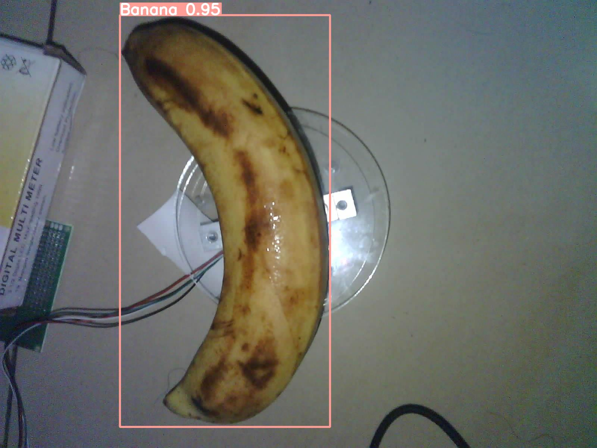
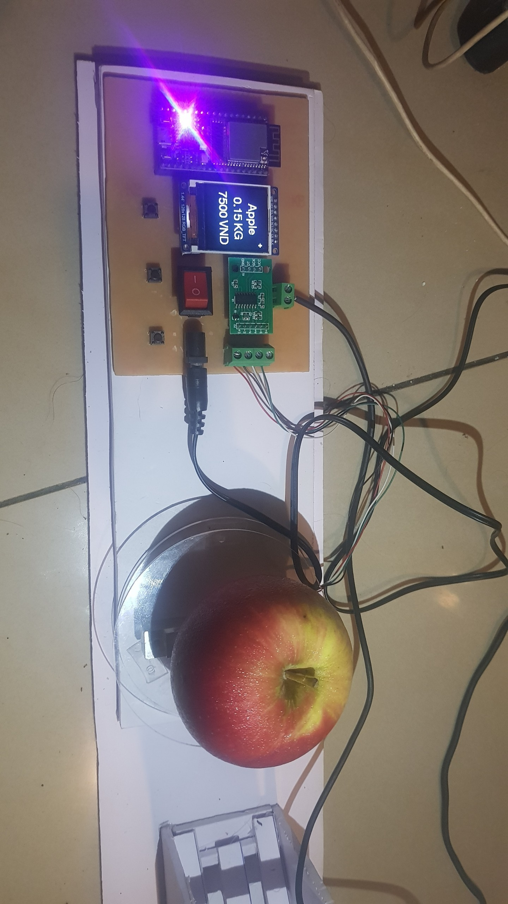

# Smart Scale

My second uni project: Smart Scale that can print receipt and detect objects on scale using YOLOv5 model.
This system includes:
- A scale prototype using ESP32-CAM to capture images of object and another ESP32 included board to read loadcell data. Data will be send back and forth between ESP32-CAM and server. [ESP32-CAM code](/esp32/esp32camjson/) | [ESP32 code](/esp32/loadcell/) | [loadcell board schematic](/schematic)
- Local [server](/backend/) on PC that runs YOLOv5 to detect objects and calculate object's price using results from the model.

## Screenshots

